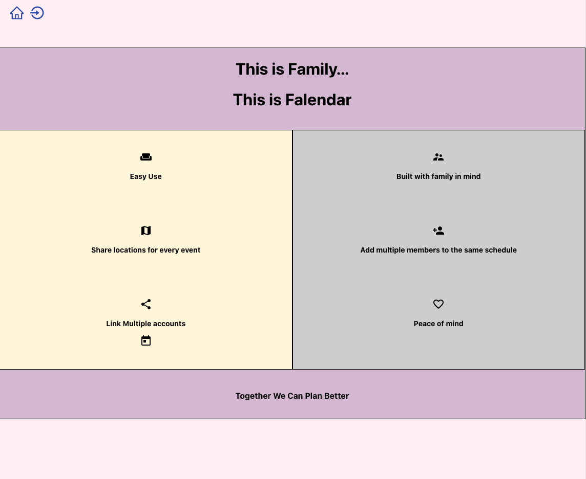

# Welcome to the Falendar App

### Technologies Used
Database Structure:
    Mongo/Mongoose
Server:
    Express
Front-end Language:
    React.js
Back-end Language:
    Node.js

### Installation

Fork and clone this repo

run npm i to install dependencies

.env.local will require a connection to [this repo](https://github.com/EllieLissner/Collab-MERN-Server)

You will need an API key from [Open Weather](https://openweathermap.org/api)  

set the keys to your variables in your .env file to 
    (REACT_APP_SERVER_URL)
    (REACT_APP_WEATHER_API)

## Approach

The goal was to make a stripped down calendar which is easy to read at a glance. 
Your regular events are available at the click of a button, but your daily itinerary 
is immediately available, which is really what most people really want anyway to 
stay on top of the days activities. 

React was uniquely suited to this challenge with its component based framework. We 
were able to leverage this functionality to send the daily itinerary to multiple views 
to keep the viewer organized. Also, any kind of calendar will benefit from being broken 
into several parts to reduce the lines of code within any one file and also greatly 
improves organization. 

Luckily there is a library built into React that we were able to use for a large portion 
of the calendar functionality. We leveraged this heavily to create a functional calendar 
within the time frame we were given. Then pop in a little weather api so you know what to 
expect for any outdoor activities and you are good to go!

## User Stories

* The user will open the app and be met with a login page

* the user will either login with credentials or they will tap a link to register

* Once logged in, the user will be met with their itinerary and weather for the day  with 
an icon to dive deeper into theri calendar if they chooose.

* Once the calendar icon is clicked, the user will view the month with events rendered within
it. the user can choose to either view the weekly or daily schedule from this view. The user 
can also tap an icon to add a new event.

* Once the add event icon is clicked, the user is prompted with a form to fill out the 
details of the event

* If the event is set for the day it is written, it will be automatically added to the daily 
itinerary list on the front landing page

## Wireframes

[PDF of wireframes](public/img/Group7.pdf)

